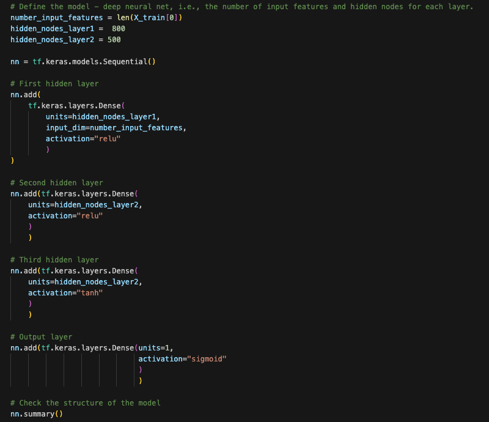
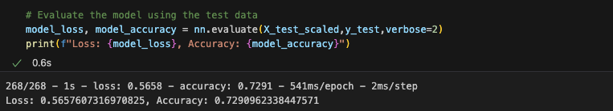

#### week21-deep-learning-challenge

## Alphabet Soup Funding Success Prediction Model

1. _Overview of the analysis_:

---

The purpose of this analysis is to predict whether an applicant is likely to succeed with their project if they have funding approved by our company.

2. _Results_:

---

Using bulleted lists and images to support your answers, address the following questions:

**Data Preprocessing**

- The target variable is teh "IS_SUCCESSFUL, which confirms whether the money was used efficiently.
- The features for this model are:
  - AFFILIATION — Affiliated sector of industry
  - CLASSIFICATION — Government organisation classification
  - USE_CASE — Use case for funding
  - ORGANIZATION — Organisation type
  - STATUS — Active status
  - INCOME_AMT — Income classification
  - SPECIAL_CONSIDERATIONS — Special considerations for application
  - ASK_AMT — Funding amount requested
- Two variables included in the original database available were removed from the model as they do not interfere in the final outcome, therefore, are neither targets nor features. These are:
  - EIN
  - NAME

**Compiling, Training, and Evaluating the Model**

- The model initially developed had the following configuration:

  - 3 layers, being 2 hidden layers and 1 output layer
  - 8 neurons in the first layer, 5 in the second and 1 in the output layer.
  - Both hidden layers utilise 'relu' as the activation function. The output layer uses 'sigmoid'.
  - A screenshot of the code containing this model is provided below.

    

 
- It has reached a 72.68% accuracy rate, under the 75% target model performance.

    

 

- Several attempts were made to optimise the model performance. These attempts included the following methods:

  - Trying different activation models
  - Increasing the number of neurons
  - Adding a third layer

 
- The best optimisation model has reached 72.91% and is represented below:

    

 

    

 

3. _Summary_:

---

Even though the accuracy level of 72.91% from the optimisation model is significant, it is under the 75% target, demanding further tests and investigation to increase its performance. There is a possibility that this model is overfitted. I recommend the development of a different model. However, an important step is to discuss with the relevant teams what features could be removed from the new model, e.g., what column or columns from the original database have lower impact in the final outcome. After consensus is reached, new models should be tested, excluding the selected feature(s). It is likely that a new model with less features can achieve the 75% accuracy desired and, in case that is confirmed, I would recommend using that model.
